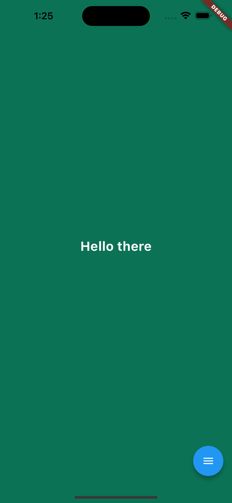
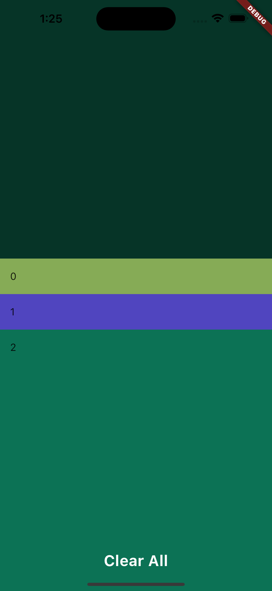
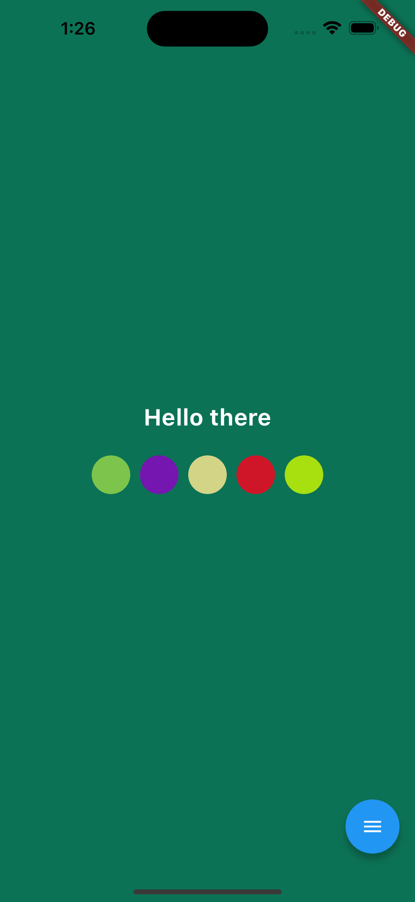

# Color Change App

Color Change App is a Flutter application that allows users to change the background color with a tap and provides additional features like color history and random color palettes.

## Features

- Tap anywhere on the screen to change the background color to a randomly generated color.
- Maintain a color history of previously generated colors and allow users to revisit and select from them.
- Randomly generate color palettes and enable users to select colors from the generated palettes.

## Screenshots

  
  
  

